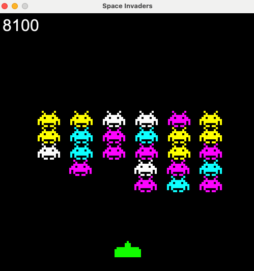

# Space Invaders Game at Home

Space Invaders is a common retro aracade game played in arcades across the world. Built from scratch using BlueJ, anyone can access the game, play for fun, and set high scores locally!

---

## Project Overview
It utilizes a graphical user interface (GUI) built in BlueJ with `JFrame` and `JPanel`, and leverages core Object-Oriented Programming (OOP) principles like inheritance. This is a great introductory game for learning inheritance and GUI in any object oriented programming language. 
I created this project to learn to use JFrame and JPanel, as this was my first GUI Java program.

### Gameplay Features
1) **Difficulty** The game starts with a 2x3 grid of aliens for Level 1 and increases by 1 row and 1 column everytime all the aliens are defeated in a level.
2) **Alien movement** The aliens first go right and then 
3) **User Controls:** * The player can use the left and right arrow keys on their keyboard to move the ship. They can press space to shoot lasers at the aliens to defeat them.
4) **Game Over Screen:** If an alien touches your ship, the game ends. However this screen allows users to restart by pressing any key on their keyboard!

---
* **Reference Tutorial:** Built following the foundational guide from [this YouTube Tutorial](https://www.youtube.com/watch?v=UILUMvjLEVU).

---

## 🚀 Live Demo
Want to see the game in action? 
👉 **[Watch the Gameplay Video Stream here](https://go.screenpal.com/watch/c0hFfqntyHS)**

Developed by @Rishaan D
